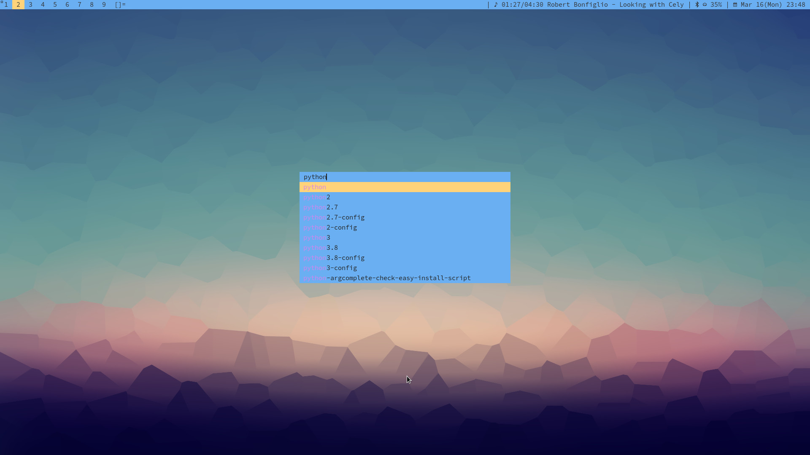

# dmenu

Fork from <https://git.suckless.org/dmenu>

## Patches list

*   dmenu-border-4.9.diff
*   dmenu-center-20200111-8cd37e1.diff
*   dmenu-fuzzymatch-4.9.diff
*   dmenu-highlight-4.9.diff
*   dmenu-lineheight-4.9.diff
*   dmenu-xresources-20200302-db6093f.diff
*   reading  highlight colors from xresources

    ```sh
    # add to ~/.xresources
    !! dmenu
    dmenu.font:             monospace:size=12
    dmenu.background:       #6ab0f3
    dmenu.foreground:       #222222
    dmenu.selbackground:    #ffd479
    dmenu.selforeground:    #222222
    dmenu.highlightbg:      #6ab0f3
    dmenu.highlightfg:      #d682ed
    dmenu.selhighlightbg:   #ffd479
    dmenu.selhighlightfg:   #d682ed
    ```

## Screenshot


